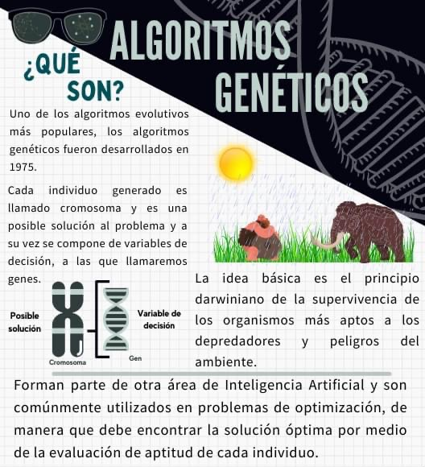
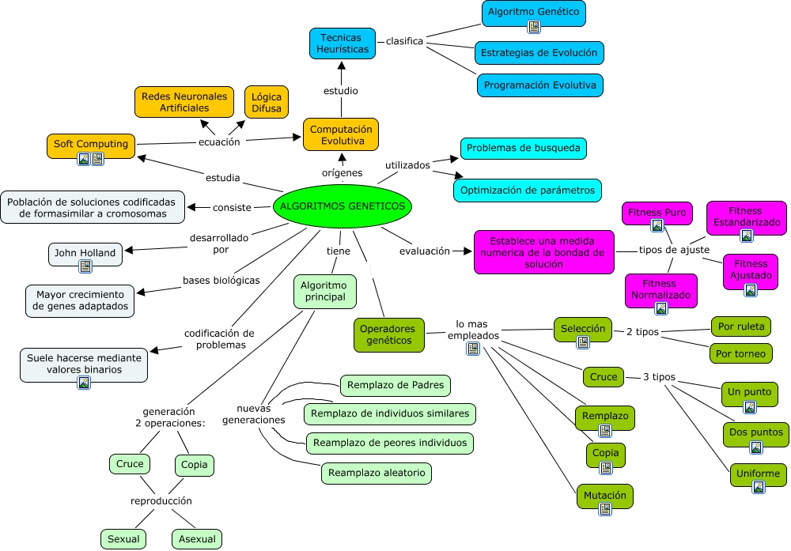
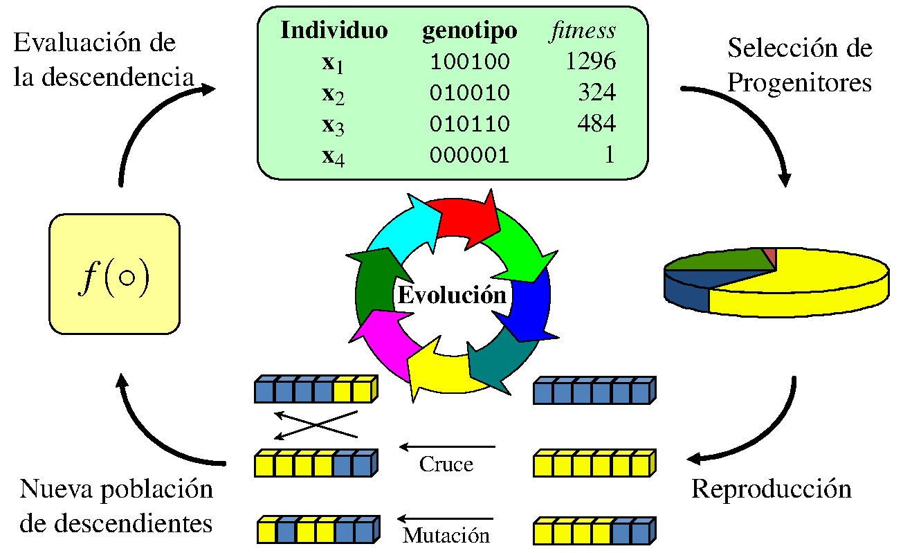
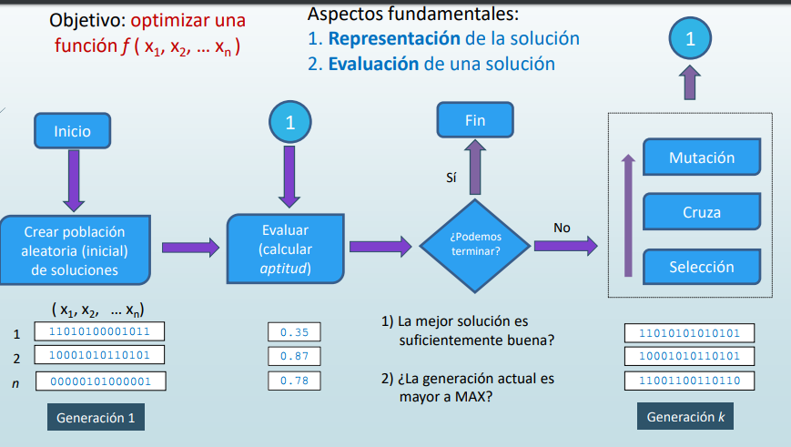

# Algoritmos Genéticos (AG)

* Son métodos adaptativos que pueden ser utilizados para implementar búsquedas y problemas de optimización.
* Son una clase particular de algoritmos evolutivos.
* Su característica principal es que se basan en técnicas inspiradas en la evolución biológica y genética.
* Utilizan reproducción, selección natural y mutación para resolver problemas complejos.

## Historia

* **1960**: John Holland introduce el concepto de algoritmos genéticos.
* **1975**: Holland publica su libro "Adaptation in Natural and Artificial Systems", donde detalla el funcionamiento de los algoritmos genéticos.
* **1989**: David E. Goldberg publica "Genetic Algorithms in Search, Optimization, and Machine Learning", uno de los libros fundamentales en el campo de los algoritmos genéticos.
* **1992**: Publicación del libro "Evolutionary Computation: Toward a New Philosophy of Machine Intelligence" de David B. Fogel, que presenta la idea de utilizar algoritmos genéticos en la resolución de problemas complejos.
* **2002**: El algoritmo genético NSGA-II es propuesto por Kalyanmoy Deb, et al., y se convierte en uno de los algoritmos más utilizados para la optimización multiobjetivo.

## Elementos

* **Población**: conjunto de posibles soluciones al problema que se desea resolver. Estas soluciones se representan mediante estructuras de datos llamadas "individuos" o "cromosomas". El método de AGs consiste en ir obteniendo de forma sucesiva distintas poblaciones.
* **Función de evaluación**: es la métrica que permite medir la calidad de cada individuo en términos de su aptitud para resolver el problema. Esta función determina qué individuos son más "aptos" y, por lo tanto, tienen más probabilidades de sobrevivir y reproducirse.
* **Operadores genéticos**: son los diferentes métodos u operaciones que se pueden ejercer sobre una población y que nos permite obtener poblaciones nuevas.
* **Selección**: proceso en el cual se eligen los individuos más aptos de la población actual para reproducirse y generar una nueva generación. La selección se realiza de acuerdo con la aptitud de cada individuo, siguiendo una estrategia similar a la selección natural.
* **Reproducción**: consiste en la combinación de los cromosomas de dos individuos seleccionados para crear nuevos individuos, utilizando operadores genéticos como la recombinación y la mutación.
* **Reemplazo**: una vez generada la nueva generación, es necesario reemplazar a la población actual con la nueva generación de individuos. Esto permite que la población evolucione y se acerque cada vez más a una solución óptima.
* **Criterio de parada**: condición que determina cuándo se debe detener el algoritmo. Puede ser un número máximo de generaciones, una solución óptima encontrada o un límite de tiempo.

* **Individuo**: es un cromosoma y es el código de información sobre el cual opera el algoritmo. Cada solución parcial del problema a optimizar está codificada en forma de cadena o string en un alfabeto determinado, que puede ser binario.

* Los operadores genéticos (recombinación y mutación) combinan y modifican soluciones existentes usando **principios lógicos**.
* La función de aptitud utiliza **lógica** para evaluar la calidad de las soluciones
* El proceso de selección se basa en **principios lógicos de selección natural**. El criterio de parada se define **lógicamente** para determinar cuándo detener el algoritmo.

## Funcionamiento

1. **Inicialización**: se genera una población inicial de individuos aleatorios.
2. **Evaluación**: se calcula la aptitud de cada individuo utilizando la función de evaluación.
3. **Selección**: se eligen los individuos más aptos para reproducirse.
4. **Reproducción**: se aplican operadores genéticos (recombinación y mutación) para crear nuevos individuos.
5. **Reemplazo**: se reemplaza la población actual con la nueva generación de individuos.
6. **Convergencia**: se repiten los pasos 2-5 hasta que se alcance un criterio de parada.

## Áreas de aplicación

* **Optimización**: los AG se utilizan para resolver problemas de optimización en diversas áreas, como la ingeniería, la logística, la planificación de rutas, la asignación de recursos y la programación.
* **Aprendizaje automático**: los AG pueden utilizarse para optimizar los parámetros y la estructura de modelos de aprendizaje automático, como redes neuronales, para mejorar su rendimiento en tareas específicas.
* **Diseño de productos y procesos**: los AG se aplican en la optimización de diseños de productos y procesos industriales, como el diseño de aerodinámica de vehículos, la generación de circuitos electrónicos, el diseño de fármacos y la ingeniería de materiales.
* **Economía y finanzas**: los AG se utilizan en la optimización de carteras de inversión, el diseño de estrategias de trading, la predicción de precios y la modelización económica.
* **Bioinformática y genómica**: los AG se emplean en el análisis de secuencias genéticas, la identificación de patrones en datos biológicos, la predicción de estructuras proteicas y la inferencia filogenética.
* **Robótica y control**: los AG pueden utilizarse en el diseño y optimización de controladores para robots, la planificación de movimientos, la navegación y la coordinación de múltiples agentes.

## Ventajas

* Exploración eficiente del espacio de búsqueda
* Capacidad para encontrar soluciones óptimas o subóptimas
* Adaptabilidad a problemas complejos con múltiples variables y restricciones
* Tolerancia a ruido o incertidumbre en los datos
* Potencial para la optimización multiobjetivo

## Desventajas

* Necesidad de definir una representación adecuada para el problema
* Posible convergencia prematura hacia una solución subóptima
* Requieren un número considerable de evaluaciones de la función objetivo
* Sensibilidad a la elección de parámetros y operadores
* No garantizan encontrar la solución óptima en todos los casos
