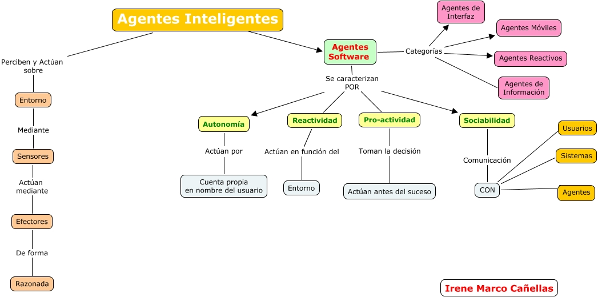

# Agentes Inteligentes (AI)

* Es una entidad que basándose en su propio conocimiento, realiza un conjunto de operaciones destinadas a satisfacer las necesidades de un usuario o un programa.
* Es capaz de percibir su entorno con la ayuda de sensores y actuar en ese medio utilizando actuadores (elementos que reaccionan a un estímulo realizando una acción).
* ¿Por qué utilizar agentes? La utilización de agentes y técnicas multiagente permite la gestión inteligente de un sistema complejo, coordinando los distintos subsistemas que lo componen e integrando objetivos particulares de cada subsistema en un objetivo común.

* Funciones básicas de la tecnología de agentes:
  * Ejecución de tareas
  * Conocimiento de su entorno
    * Conocimiento a priori
    * Aprendizaje
  * Capacidad de comunicación
    * Con usuario
    * Inter-agente

## Clasificación

* **Agentes híbridos**: son la combinación de dos o más filosofías dentro de un agente simple. Están formados por una parte reactiva y otra deliberativa estructuradas en capas con diferentes niveles de abstracción.
* **Agentes de búsqueda**: es un programa que, imitando el comportamiento de una persona y actuando de forma autónoma, recorre automáticamente internet aprovechando la estructura de enlaces de la web.
* **Agentes reactivos**: representan una categoría especial de agentes que no poseen modelos simbólicos de su entorno. Este tipo de agentes actúa en función de los estímulos externos sin tener en cuenta el tiempo pasado del entorno ni el futuro del mismo. Responden de forma directa proporcionando un tiempo de respuesta y de proceso muy alto.
* **Agentes de información**: necesita un campo de cobertura no muy amplio que le permita interactuar perfectamente con el medio en que se desarrolla y tienden a hacer transparente la complejidad almacenada en la red.
* **Agentes móviles**: es el que lleva a cabo alguna tarea para el usuario y que al hacerlo, visita varios ordenadores de una red. El agente logra realizar esta función porque su código es copado en el ordenador remoto y se ejecuta allí.
* **Agentes de interfaz**: son los que apoyan y dan asistencia, principalmente al usuario, para que aprenda a utilizar una aplicación en particular.
