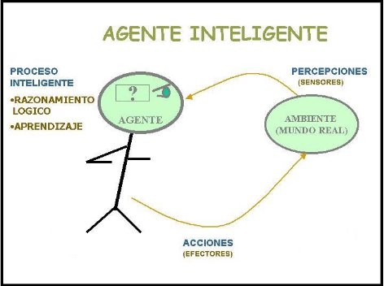

# Agentes Inteligentes (AI)

* Es una entidad que basándose en su propio conocimiento, realiza un conjunto de operaciones destinadas a satisfacer las necesidades de un usuario o un programa.
* Son programas o sistemas diseñados para realizar tareas específicas de manera autónoma y adaptativa, utilizando técnicas de inteligencia artificial (IA).
* Están diseñados para percibir su entorno con la ayuda de sensores, tomar decisiones y actuar en ese medio utilizando actuadores (elementos que reaccionan a un estímulo realizando una acción) con el objetivo de alcanzar ciertos objetivos o maximizar ciertas medidas de rendimiento.
* ¿Por qué utilizar AI? La utilización de AI y técnicas multiagente permite la gestión inteligente de un sistema complejo, coordinando los distintos subsistemas que lo componen e integrando objetivos particulares de cada subsistema en un objetivo común.


* Funciones básicas de la tecnología de agentes:
  * Ejecución de tareas
  * Conocimiento de su entorno
    * Conocimiento a priori
    * Aprendizaje
  * Capacidad de comunicación
    * Con usuario
    * Inter-agente

## Clasificación I

* **Agentes físicos**: son robots o sistemas incorporados en dispositivos físicos que interactúan directamente con el mundo físico. Por ejemplo, un robot de limpieza autónomo que navega por una habitación, reconoce objetos y realiza tareas de limpieza.
* **Agentes virtuales**: son programas de software que operan en un entorno virtual, como en una computadora o en la web. Estos agentes pueden realizar diversas tareas, como recopilar información, realizar recomendaciones, ofrecer asistencia en línea o interactuar con usuarios en aplicaciones de chat.

* Los AI pueden utilizar una variedad de técnicas y algoritmos de IA para tomar decisiones y aprender de su entorno. Algunas de estas técnicas incluyen el aprendizaje automático (machine learning), el procesamiento del lenguaje natural, la visión por computadora, la planificación y la optimización.

## Clasificación II

* **Agentes híbridos**: son la combinación de dos o más filosofías dentro de un agente simple. Están formados por una parte reactiva y otra deliberativa estructuradas en capas con diferentes niveles de abstracción.
* **Agentes de búsqueda**: es un programa que, imitando el comportamiento de una persona y actuando de forma autónoma, recorre automáticamente internet aprovechando la estructura de enlaces de la web.
* **Agentes reactivos**: representan una categoría especial de agentes que no poseen modelos simbólicos de su entorno. Este tipo de agentes actúa en función de los estímulos externos sin tener en cuenta el tiempo pasado del entorno ni el futuro del mismo. Responden de forma directa proporcionando un tiempo de respuesta y de proceso muy alto.
* **Agentes de información**: necesita un campo de cobertura no muy amplio que le permita interactuar perfectamente con el medio en que se desarrolla y tienden a hacer transparente la complejidad almacenada en la red.
* **Agentes móviles**: es el que lleva a cabo alguna tarea para el usuario y que al hacerlo, visita varios ordenadores de una red. El agente logra realizar esta función porque su código es copado en el ordenador remoto y se ejecuta allí.
* **Agentes de interfaz**: son los que apoyan y dan asistencia, principalmente al usuario, para que aprenda a utilizar una aplicación en particular.

## Historia

* Se podría decir que los orígenes de los AI comienzan en la década de los 50, cuando los científicos comenzaron a explotar la idea de la IA y cómo las máquinas podrían emular el comportamiento de los seres humanos.
* En el año 1950, el británico Alan Turing propone la "Prueba de Turing" como un criterio para evaluar la inteligencia de una máquina.
* A mediados de los 60, Joseph Weizenbaum del MIT, creó ELIZA, uno de los primeros programas de procesamiento del lenguaje natural desarrollado en el campo de la IA. Ésta fue diseñada para simular una conversación con un terapeuta, y se basaba principalmente en el reconocimiento de patrones, siendo así, uno de las primeras implementaciones exitosas de un chatbot.
* En la década de los 70, los investigadores exploraron la idea de AI que pudiesen percibir y actuar en los entornos más complejos. Surgieron trabajos sobre planificación automática que permiten a los agentes generar secuencias de acciones para lograr objetivos específicos.
* Con el avance de la tecnología y la disponibilidad de grandes cantidades de datos, el aprendizaje automático y las redes neuronales se convirtieron en técnicas fundamentales para los AI. Los avances en el procesamiento del lenguaje natural, la visión por computadora y la robótica impulsaron el desarrollo de AI más sofisticados y capaces.

## Funcionamiento

* Los agentes inteligentes funcionan a través de un ciclo de percepción-razonamiento-acción:
  * **Percepción**: Los agentes inteligentes tienen sensores o medios de percepción que les permiten captar información sobre su entorno. Estos sensores pueden incluir cámaras, micrófonos, sensores táctiles, entre otros, dependiendo del tipo de agente y su tarea específica. La información percibida se convierte en datos procesables por el agente.
  * **Razonamiento**: Una vez que el agente ha recopilado información del entorno, utiliza técnicas de inteligencia artificial y algoritmos para razonar y tomar decisiones basadas en esos datos. Esto puede implicar el uso de métodos de aprendizaje automático, algoritmos de planificación, lógica, razonamiento probabilístico u otras técnicas según las necesidades del agente.
  * **Toma de decisiones**: Con base en el razonamiento realizado, el agente toma decisiones sobre qué acción o acciones debe llevar a cabo para alcanzar su objetivo o cumplir con su tarea. Estas decisiones pueden estar influenciadas por reglas predefinidas, conocimientos previos o por el aprendizaje adquirido a través de la interacción con el entorno.
  * **Acción**: Una vez que el agente ha tomado una decisión, ejecuta la acción correspondiente en el entorno. Esto puede implicar la emisión de comandos a dispositivos físicos (en el caso de agentes físicos) o la generación de respuestas o acciones virtuales (en el caso de agentes virtuales). Las acciones pueden tener efectos en el entorno, y el ciclo de percepción-razonamiento-acción se repite continuamente para permitir que el agente interactúe y se adapte a su entorno en tiempo real.



## Donde encontramos los AI?

1. **Asistentes virtuales**: Siri de Apple, el asistente de Google y Alexa de Amazon, son agentes inteligentes diseñados para ayudar a los usuarios a realizar tareas y obtener información utilizando el procesamiento del lenguaje natural y la inteligencia artificial.
2. **Motores de búsqueda**: Como Google y Bing, utilizan agentes inteligentes para indexar y clasificar contenido web, ofreciendo resultados relevantes y personalizados a los usuarios.
3. **Automóviles autónomos**: Éstos utilizan agentes inteligentes para procesar datos de sensores y tomar decisiones en tiempo real para navegar de forma eficiente y segura en el tráfico.
4. **Sistemas de recomendación**: Utilizados en plataformas de streaming de música y video, sitios de comercio electrónico y redes sociales, utilizan agentes inteligentes para analizar datos y brindar recomendaciones de acuerdo a las preferencias de los usuarios.
5. **Robótica**: Los robots utilizan agentes inteligentes para interactuar con su entorno, realizar tareas específicas y adaptarse a situaciones cambiantes
6. **Salud**: Se aplican en el diagnóstico médico, el análisis de imágenes médicas, la investigación de fármacos y la monitorización de pacientes entre otros usos.

## Ejemplo en PROLOG: Las torres de Hanói


* El problema de las Torres de Hanoi es un famoso problema matemático y de lógica.
* Consiste en mover una pila de discos de una torre inicial a una torre final, utilizando una torre auxiliar como ayuda.
* El problema tiene las siguientes reglas:
  * Solo se puede mover un disco a la vez.
  * Un disco grande no puede colocarse sobre un disco de menor tamaño.
  * Solo se pueden realizar movimientos válidos desde una torre a otra.
  * El objetivo es mover todos los discos de la torre inicial a la torre final, respetando las reglas mencionadas.

* El número de discos en el problema determina la complejidad del mismo. Para resolver el problema de las Torres de Hanoi con **N** cantidad de discos, se requieren **2^N - 1** movimientos.

```prolog
mover(1, X, Y, _) :-
    write('Mueva el disco superior de '),
    write(X),
    write(' a '),
    write(Y),
    nl.

mover(N, X, Y, Z) :-
    N > 1,
    M is N - 1,
    mover(M, X, Z, Y),
    mover(1, X, Y, _),
    mover(M, Z, Y, X).

hanoi(N) :-
    mover(N, 'Torre 1', 'Torre 3', 'Torre 2'). 
```
