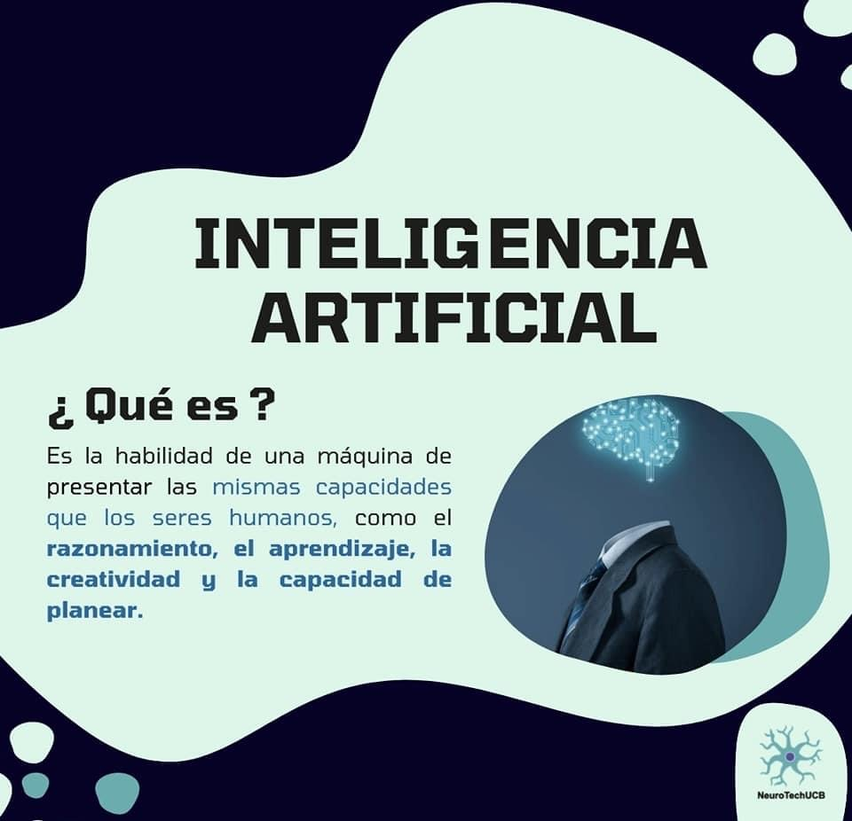
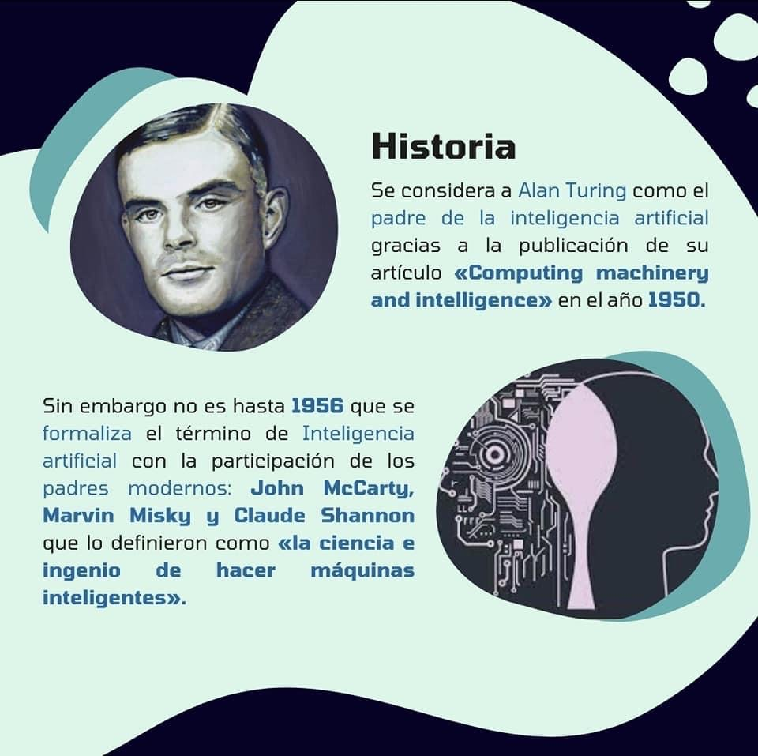
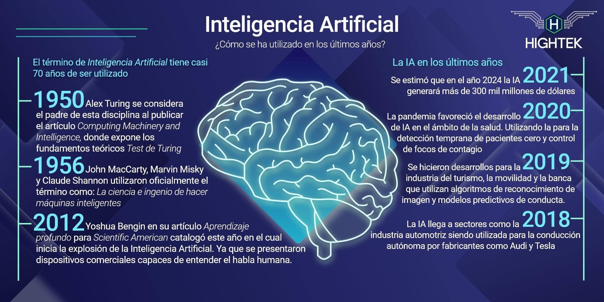
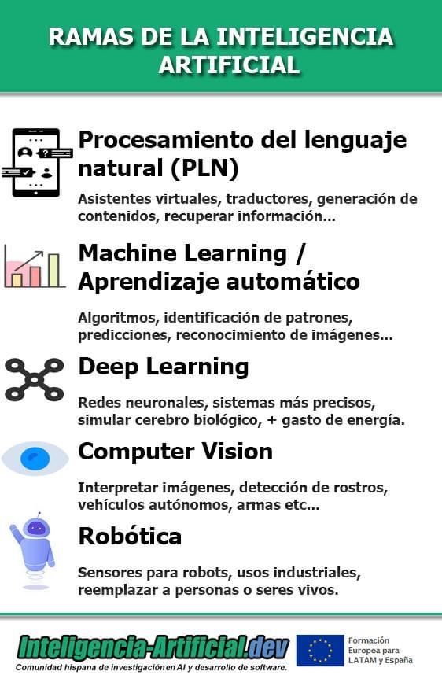
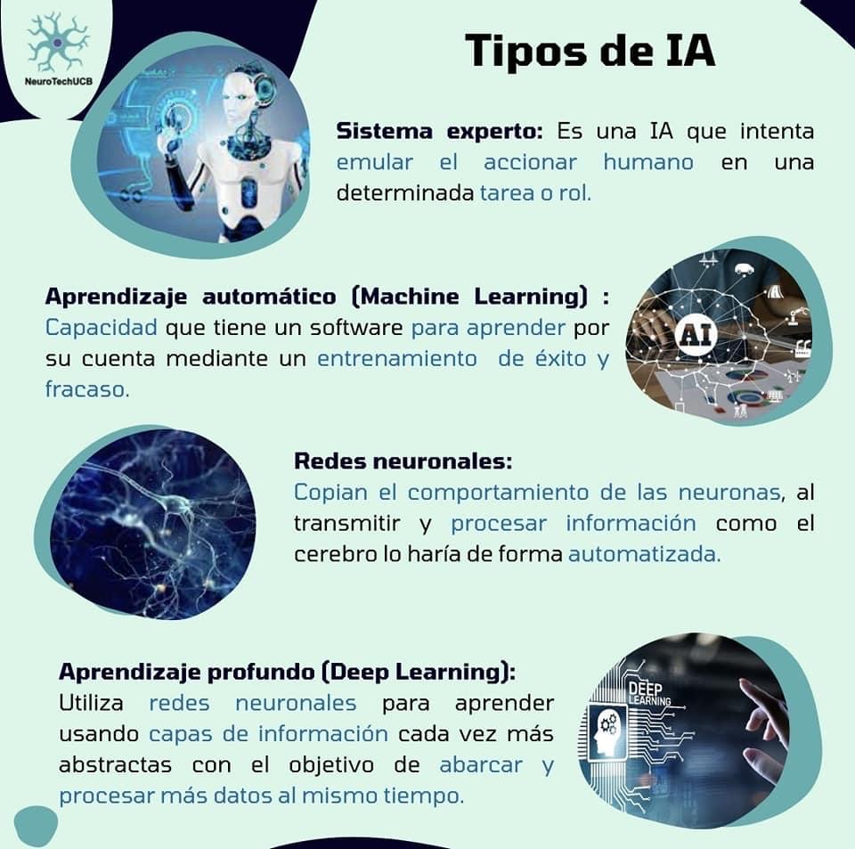

# Inteligencia Artificial

* Es la capacidad dada a una computadora para resolver una tarea con información obtenida a través del análisis de un contexto.
* Es la capacidad de una máquina para imitar el comportamiento humano a través de algoritmos sacando provecho de los datos y el poder computacional.
* Hace referencia a la forma en la que las máquinas aprenden y llevan a cabo acciones similares a las que un humano podría desempeñar, eliminando el margen de error que se espera de una persona.
* Un programa de IA consiste en obtener datos, procesarlos, generar una respuesta y tomar una decisión.
* Para mejorar las respuestas, el programa suele aprender e identificar patrones.

## Historia

## Ramas

## Tipos de IA

* **Débil**: desarrollada para hacer una tarea en particular.
* **Fuerte**: creada para contar con habilidades cognitivas en un área.

* **Narrow IA**: realiza tareas específicas como reconocer un rostro o una voz. Ejemplo: Google Lens
* **General IA**: similar a la conducta humana, toma el conocimiento en lo que hasido entrenado y aprende algo nuevo. Ejemplo: Siri oo Alexa
* **Super IA**: es proyecto que permanece en la fantasía, pero se cree que superará la inteligencia de los humanos. Ejemplo: J.A.R.V.I.S. del universo Marvel.
