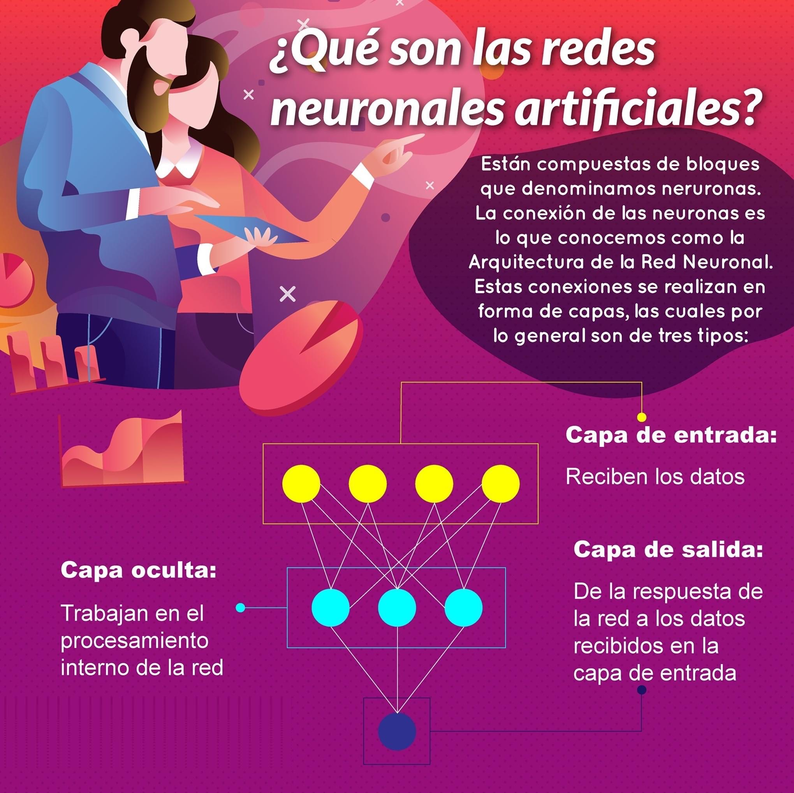
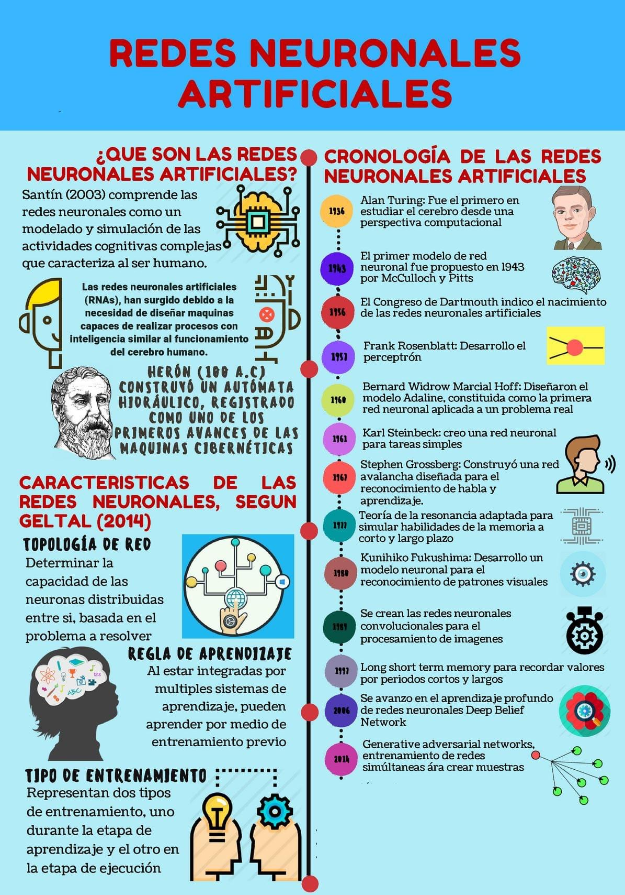
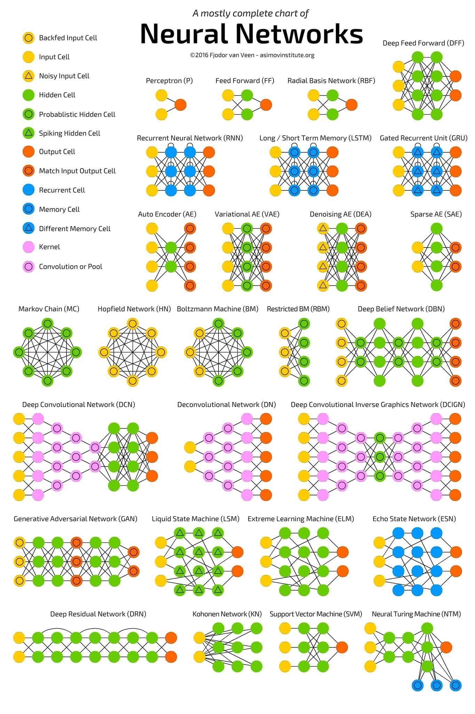

# Redes Neuronales Artificiales (RNA)

* Son modelos de la IA que se inspiran en el comportamiento de las neuronas y las conexiones cerebrales para resolver problemas.
* Es un modelo simplificado que simula cómo los cerebros de los seres vivos, en especial el humano, procesa información.
* Las RNA se inspiran en el sistema nervioso y el comportamiento biológico, creando un sistema de interconexión en capas de neuronas artificiales que colaboran para procesar datos de entrada y generar salidas.
* Las RNA se diferencian de otros modelos de IA en tener la capacidad de aprender en forma automática Este proceso también es conocido como machine learning o aprendizaje de máquina.

## Aplicaciones

* Sistemas inteligentes para la toma de decisiones en la gestión empresarial.
* Predicción.
* Reconocimiento de tendencias.
* Reconocimiento de patrones y gestión de riesgo, aplicados por ejemplo en la detección de fraude.
* Artefactos inteligentes con capacidad de aprendizaje, por ejemplo, parlantes inteligentes.
* Hogar inteligente.
* Vehículos autónomos y energías renovables.

## Tipos

## Perceptrón simple

* Es un modelo neuronal binario lineal que separa los resultados en solo dos grupos, aplicado para software IA de agrupación de datos binarios. Cuenta con:
  * Entradas x1, x2 y x3 (valores iniciales binarios: 0 y 1)
  * Pesos sinápticos w1, w2 y w3 correspondientes a cada entrada (valores entre -1 y 1 aleatorios)
  * Función de Iteración wj = wj + e(tj) \* xj (nuevo peso = peso actual + factor de aprendizaje \* valor esperado * entrada)
  * Función de activación f(x) = 1 si el resultado de fórmula es >= 0; caso contrario 0
  * Salida y (se espera obtener los valores esperados binarios)

* Algoritmo:
  1. Ingresar los valores binarios.
  1. Realizar el cálculo iterativo de nuevos pesos hasta obtener los valores esperados.
  1. Obtener los valores esperados.
