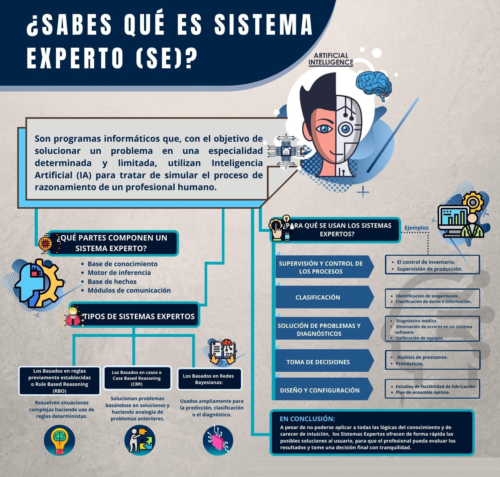
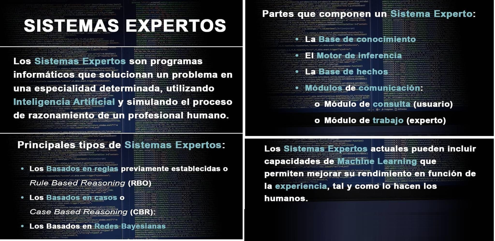
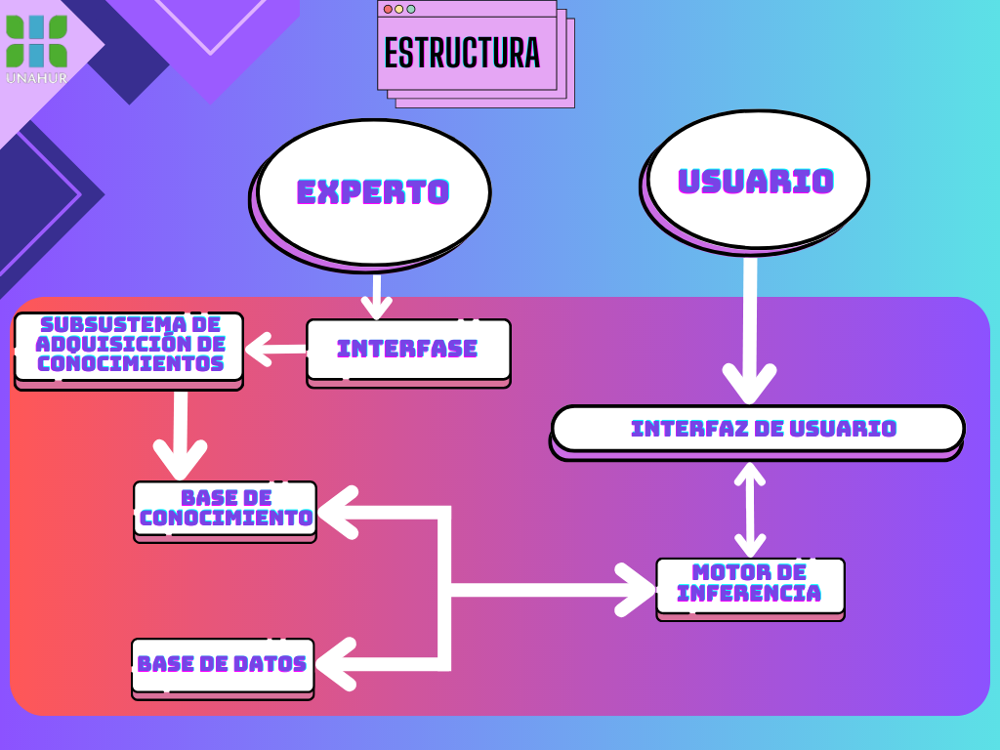
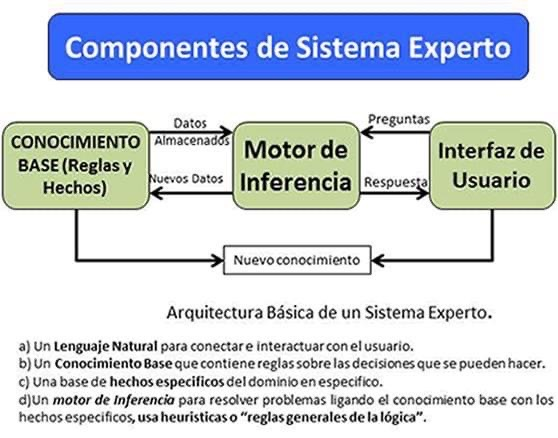
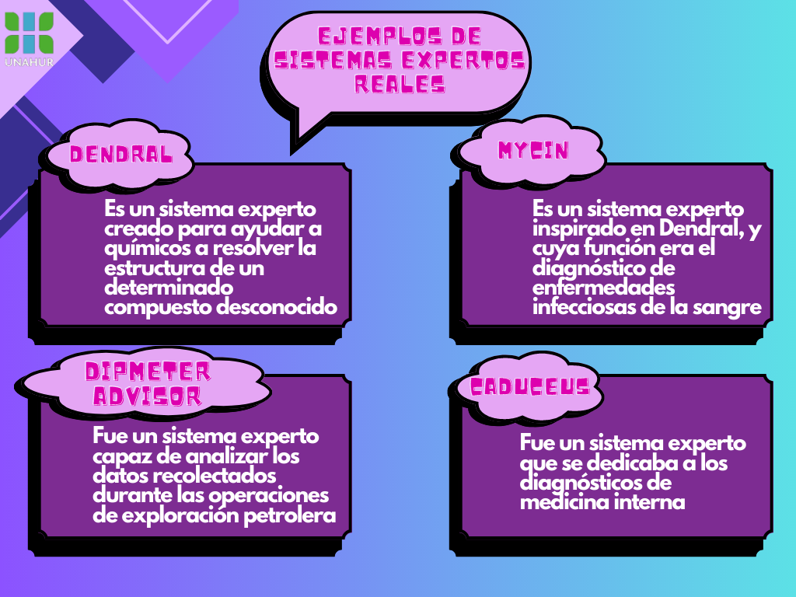

# Sistemas expertos (SE)

* Es un sistema informático que simula los procesos de aprendizaje, memorización, razonamiento, comunicación y acción de un experto humano en una determinada rama de la ciencia.
* Es un sistema que emplea conocimiento humano capturado en una computadora para resolver problemas que normalmente requieren de expertos humanos

## Características

* **Habilidad para adquirir el conocimiento**: esto es igual a decir que el software haya sido bien diseñado.
* **Fiabilidad**: que nos proporcione resultados con el menor número de errores posible.
* **Capacidad**: poder responder al mayor número de problemas en su área.

1. Ayuda a la toma de decisiones con la competencia de un experto, ya que lo que hacemos es volcar en dicho sistema el conocimiento que tienen los expertos humanos.
1. Representa el conocimiento basándose en la inferencia. La inferencia de las reglas que son depositadas dentro de la base de datos de conocimiento
1. La inferencia se realiza mediante el tratamiento de un gran volumen de conocimiento de tipo teórico.
1. El sistema razona sobre esas operaciones y ese razonamiento de tipo lógico basado en reglas. Si existe un antecedente y el consecuente se da y el consecuente es un hecho, se da entrada a una nueva regla.
1. Constituye un sistema que no es algorítmico : A pesar de los dos algoritmos base que utiliza dicho sistema para poder manejarse en realidad en sí el descubrimiento de la información no es un sistema algorítmico.
1. Admite una fácil modificación del conocimiento sin reprogramar el sistema. Aumentamos el conocimiento a medida que aumentamos las reglas, y vayamos modificando dichas reglas.
1. El usuario dialoga con un sistema natural.

## Componentes

## Clasificación

* **CBR** (Case Based Reasoning): es decir, razonamiento basado en casos. Almacenan y utilizan una base de conocimiento compuesta por casos o ejemplos específicos. Cada caso contiene información detallada sobre una situación o problema y la solución correspondiente proporcionada por el experto. El sistema busca casos similares al problema actual y utiliza las soluciones pasadas como guía para resolver el problema actual
* **RBR** (Rules Based Reasoning): es el que viene dado por la sujeción a reglas preestablecidas. Utilizan una base de conocimiento compuesta por reglas if-then, donde las reglas representan el conocimiento y las decisiones del experto. El sistema aplica estas reglas a los datos de entrada para llegar a conclusiones o recomendaciones.
* **Basados en redes bayesianas**: aquí se fusionan el teorema de Bayes y la teoría de la probabilidad, con lo que se consigue un sinnúmero de variables aleatorias. Utiliza modelos probabilísticos llamados redes bayesianas para representar el conocimiento y el razonamiento experto. Estas redes capturan las relaciones de dependencia entre variables y se utilizan para realizar inferencias y tomar decisiones basadas en la evidencia disponible. Estos sistemas son útiles en situaciones de incertidumbre y con datos limitados, y se aplican en campos como medicina, análisis de riesgos y toma de decisiones.

## Distintas aplicaciones de los Sistemas Expertos

* **Interpretación**: Describen una situación a partir de unos datos proporcionados
* **Predicción**: Deducen consecuencias futuras probables a partir de situaciones dadas
* **Diagnóstico**: A partir de datos ( normalmente incompletos) averiguar la causa (Ej. Diagnóstico médico)
* **Diseño**: Construyen objetos a partir de ciertas restricciones dadas (Ej. CAD).
* **Planificacion**: Diseñan acciones, establecen cursos de acción ( Ej. Robots).
* **Control**: Realizan monitorización, corrección de errores y reparación de forma continua en el tiempo. Dentro de este se realizan un conjunto de sistemas tales como:
  * **Monitorización**: Parecidos a la interpretación, pero además se detecta si la situación es normal o no.
  * **Correción de errores**: Establece los fallos del problema y da soluciones para resolverlos.
  * **Reparación**: Corrige los errores detectados para que vuelva a ser correcta la situación.

## Ejemplos de Sistemas Expertos Reales

## Sistemas Expertos y PROLOG

* **Representacion del Conocimiento**: Prolog permite representar el conocimiento utilizado en un sistema experto utilizando hechos y reglas
  * **Hechos**:  Estos pueden representar información objetiva y los predicados pueden representar relaciones entre diferentes conceptos.
  * **Reglas**: Estas pueden expresar el razonamiento y las inferencias lógicas utilizadas por el sistema experto.
* **Motor de Inferencia**: Prolog proporciona un motor de inferencia incorporado que puede realizar la inferencia lógica basada en las reglas y hechos definidos. Esto permite que el sistema experto realice deducciones y derive conclusiones a partir de la base de conocimiento.
* **Consultas y Respuestas**: Prolog permite realizar consultas para obtener respuestas basadas en la base de conocimiento del sistema experto. Es Posible hacer preguntas y obtener respuestas lógicas en forma de "verdadero" o "falso", o incluso obtener soluciones más detalladas utilizando variables lógicas.
* **Mantenimiento y Actualizacion de la Base de Conocimiento**: Prolog facilita la adición, modificación y eliminación de hechos y reglas en la base de conocimiento del sistema experto. Lo cual permite mantener y actualizar el conocimiento del sistema a medida que se adquiere nueva información o se realizan cambios en el dominio.

## Ejemplos de PROLOG

