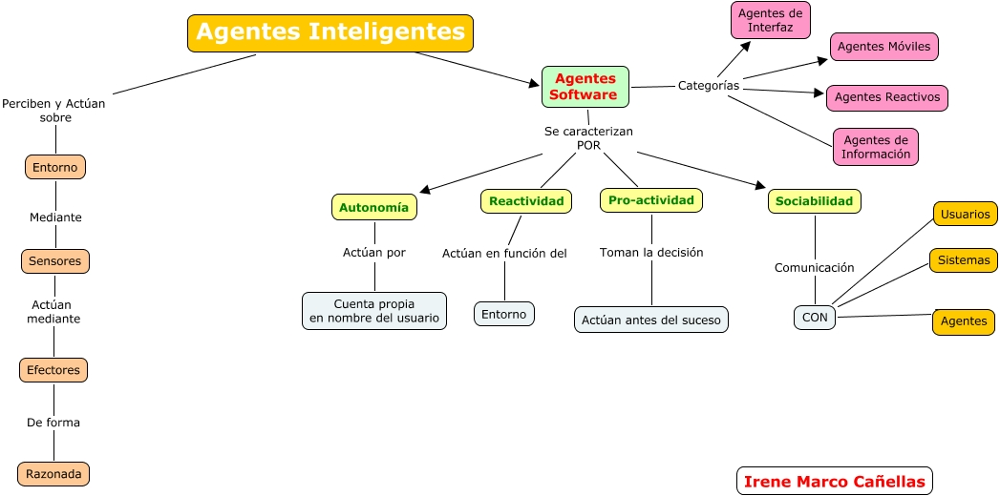
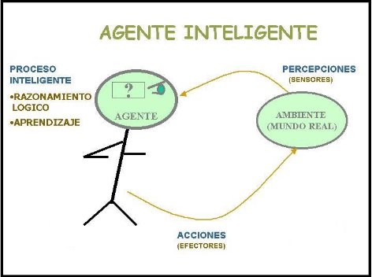

# Agentes Inteligentes (AI)

* Es una entidad que basándose en su propio conocimiento, realiza un conjunto de operaciones destinadas a satisfacer las necesidades de un usuario o un programa.
* Son programas o sistemas diseñados para realizar tareas específicas de manera autónoma y adaptativa, utilizando técnicas IA.
* Es una entidad que percibe su entorno a través de sensores y actúa sobre dicho entorno mediante actuadores. Los agentes pueden ser simples programas de software o robots complejos.
* Están diseñados para percibir su entorno con la ayuda de sensores, tomar decisiones y actuar en ese medio utilizando actuadores (elementos que reaccionan a un estímulo realizando una acción) con el objetivo de alcanzar ciertos objetivos o maximizar ciertas medidas de rendimiento.
* ¿Por qué utilizar AI? La utilización de AI y técnicas multiagente permite la gestión inteligente de un sistema complejo, coordinando los distintos subsistemas que lo componen e integrando objetivos particulares de cada subsistema en un objetivo común.

* Funciones básicas de la tecnología de agentes:
  * Ejecución de tareas
  * Conocimiento de su entorno
    * Conocimiento a priori
    * Aprendizaje
  * Capacidad de comunicación
    * Con usuario
    * Interagente

## Características de un agente

* **Autonomía**: capacidad de operar sin intervención humana
* **Reactividad**: respuesta a cambios en el entorno en tiempo real
* **Proactividad**: comportamiento dirigido a objetivos y capacidad de tomar la iniciativa
* **Sociabilidad**: capacidad de comunicarse y cooperar con otros agentes o humanos

## Clasificación I

* **Agentes físicos**: son robots o sistemas incorporados en dispositivos físicos que interactúan directamente con el mundo físico. Por ejemplo, un robot de limpieza autónomo que navega por una habitación, reconoce objetos y realiza tareas de limpieza.
* **Agentes virtuales**: son programas de software que operan en un entorno virtual, como en una computadora o en la web. Estos agentes pueden realizar diversas tareas, como recopilar información, realizar recomendaciones, ofrecer asistencia en línea o interactuar con usuarios en aplicaciones de chat.

* Los AI pueden utilizar una variedad de técnicas y algoritmos de IA para tomar decisiones y aprender de su entorno. Algunas de estas técnicas incluyen el aprendizaje automático (machine learning), el procesamiento del lenguaje natural, la visión por computadora, la planificación y la optimización.

## Clasificación II

* **Agentes simples**: funcionan en base a reglas predefinidas (si-esto-entonces-aquello) y no tienen memoria
* **Agentes basados en modelo**: tienen un modelo del mundo que utilizan para tomar decisiones más informadas y manejar situaciones donde no todas las variables están presentes
* **Agentes basados en objetivos**: operan para alcanzar objetivos específicos y pueden elegir entre varias acciones para lograr sus metas
* **Agentes basados en utilidades**: eligen acciones basándose en la maximización de una función de utilidad, buscando el mejor estado posible según una medida cuantificable
* **Agentes de aprendizaje**: pueden aprender y mejorar su comportamiento con el tiempo a través de la experiencia

## Clasificación III

* **Agentes híbridos**: son la combinación de dos o más filosofías dentro de un agente simple. Están formados por una parte reactiva y otra deliberativa estructuradas en capas con diferentes niveles de abstracción.
* **Agentes de búsqueda**: es un programa que, imitando el comportamiento de una persona y actuando de forma autónoma, recorre automáticamente internet aprovechando la estructura de enlaces de la web.
* **Agentes reactivos**: representan una categoría especial de agentes que no poseen modelos simbólicos de su entorno. Este tipo de agentes actúa en función de los estímulos externos sin tener en cuenta el tiempo pasado del entorno ni el futuro del mismo. Responden de forma directa proporcionando un tiempo de respuesta y de proceso muy alto.
* **Agentes de información**: necesita un campo de cobertura no muy amplio que le permita interactuar perfectamente con el medio en que se desarrolla y tienden a hacer transparente la complejidad almacenada en la red.
* **Agentes móviles**: es el que lleva a cabo alguna tarea para el usuario y que al hacerlo, visita varios ordenadores de una red. El agente logra realizar esta función porque su código es copado en el ordenador remoto y se ejecuta allí.
* **Agentes de interfaz**: son los que apoyan y dan asistencia, principalmente al usuario, para que aprenda a utilizar una aplicación en particular.

## Ventajas y Desventajas de los Tipos de Agentes

| Tipo de Agente             | Ventajas                                                                                   | Desventajas                                                                        |
|----------------------------|--------------------------------------------------------------------------------------------|------------------------------------------------------------------------------------|
| Agentes Simples            | Simplicidad, fácil de implementar y mantener.                                              | Limitados a entornos predecibles, no pueden adaptarse a cambios imprevistos.       |
| Agentes Basados en Modelo  | Mejor toma de decisiones en entornos complejos, pueden manejar incertidumbre.              | Requieren más recursos computacionales, complejidad en la creación del modelo.      |
| Agentes Basados en Objetivos| Orientados a metas, pueden adaptarse a diferentes caminos para lograr objetivos.          | Pueden ser más difíciles de programar, requieren definición clara de objetivos.    |
| Agentes Basados en Utilidades| Maximización de resultados, pueden evaluar múltiples opciones.                           | Complejos de implementar, pueden requerir mucho tiempo para evaluar todas las opciones. |
| Agentes de Aprendizaje     | Capacidad de mejorar con el tiempo, adaptabilidad a nuevos entornos y situaciones.        | Requieren datos de entrenamiento, posibles problemas de sobreajuste o subajuste.   |

## Arquitectura

* **Arquitectura reactiva**: compuesta por reglas simples de condición-acción. Es adecuada para entornos dinámicos y cambiantes
* **Arquitectura basada en planificación**: el agente realiza una planificación previa antes de actuar, utilizando un modelo del entorno y simulando diferentes cursos de acción
* **Arquitectura híbrida**: combina características de arquitecturas reactivas y basadas en planificación, permitiendo tanto respuestas rápidas como acciones planeadas a largo plazo

## Funcionamiento

* Los agentes inteligentes funcionan a través de un ciclo de percepción-razonamiento-acción:
  * **Percepción**: Los agentes inteligentes tienen sensores o medios de percepción que les permiten captar información sobre su entorno. Estos sensores pueden incluir cámaras, micrófonos, sensores táctiles, entre otros, dependiendo del tipo de agente y su tarea específica. La información percibida se convierte en datos procesables por el agente.
  * **Razonamiento**: Una vez que el agente ha recopilado información del entorno, utiliza técnicas de inteligencia artificial y algoritmos para razonar y tomar decisiones basadas en esos datos. Esto puede implicar el uso de métodos de aprendizaje automático, algoritmos de planificación, lógica, razonamiento probabilístico u otras técnicas según las necesidades del agente.
  * **Toma de decisiones**: Con base en el razonamiento realizado, el agente toma decisiones sobre qué acción o acciones debe llevar a cabo para alcanzar su objetivo o cumplir con su tarea. Estas decisiones pueden estar influenciadas por reglas predefinidas, conocimientos previos o por el aprendizaje adquirido a través de la interacción con el entorno.
  * **Acción**: Una vez que el agente ha tomado una decisión, ejecuta la acción correspondiente en el entorno. Esto puede implicar la emisión de comandos a dispositivos físicos (en el caso de agentes físicos) o la generación de respuestas o acciones virtuales (en el caso de agentes virtuales). Las acciones pueden tener efectos en el entorno, y el ciclo de percepción-razonamiento-acción se repite continuamente para permitir que el agente interactúe y se adapte a su entorno en tiempo real.

## Donde encontramos los AI?

1. **Sistemas Multiagente**: colección de agentes que interactúan para resolver problemas que son demasiado complejos para un solo agente. Ejemplos incluyen mercados electrónicos y sistemas de simulación
1. **Agentes en Videojuegos**: controlan personajes no jugables (NPCs), proporcionando comportamientos inteligentes y adaptativos
1. **Asistentes virtuales**: Siri de Apple, el asistente de Google y Alexa de Amazon, son agentes inteligentes diseñados para ayudar a los usuarios a realizar tareas y obtener información utilizando el procesamiento del lenguaje natural y aprendizaje automático
1. **Motores de búsqueda**: como Google y Bing, utilizan agentes inteligentes para indexar y clasificar contenido web, ofreciendo resultados relevantes y personalizados a los usuarios
1. **Automóviles autónomos**: utilizan agentes inteligentes para procesar datos de sensores y tomar decisiones en tiempo real para navegar de forma eficiente y segura en el tráfico
1. **Sistemas de recomendación**: utilizados en plataformas de streaming de música y video, sitios de comercio electrónico y redes sociales, utilizan agentes inteligentes para analizar datos y brindar recomendaciones de acuerdo a las preferencias de los usuarios
1. **Robótica**: los robots utilizan agentes inteligentes para interactuar con su entorno, realizar tareas específicas y diversas (desde limpieza del hogar hasta exploración espacial) y adaptarse a situaciones cambiantes
1. **Salud**: Se aplican en el diagnóstico médico, el análisis de imágenes médicas, la investigación de fármacos y la monitorización de pacientes entre otros usos

## Desafíos y Consideraciones

* **Complejidad computacional**: el procesamiento de información y la toma de decisiones en tiempo real puede ser computacionalmente intensivo
* **Seguridad y ética**: garantizar que los agentes actúen de manera segura y ética, especialmente en aplicaciones críticas como la conducción autónoma
* **Interacción Humano-Agente**: diseñar interfaces y métodos de comunicación efectivos para la colaboración entre humanos y agentes

## Herramientas y Tecnologías para Agentes Inteligentes

### Plataformas de Desarrollo

* **JADE (Java Agent DEvelopment Framework)**: plataforma de desarrollo para sistemas multiagente
* **Jason**: extensión de AgentSpeak para la implementación de agentes inteligentes

### Lenguajes de Programación

* **Prolog**: usado para programación lógica y agentes basados en reglas
* **Python**: popular para implementar algoritmos de aprendizaje y agentes inteligentes debido a sus bibliotecas de IA como TensorFlow y PyTorch
