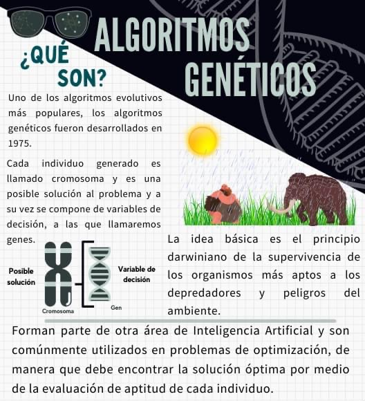
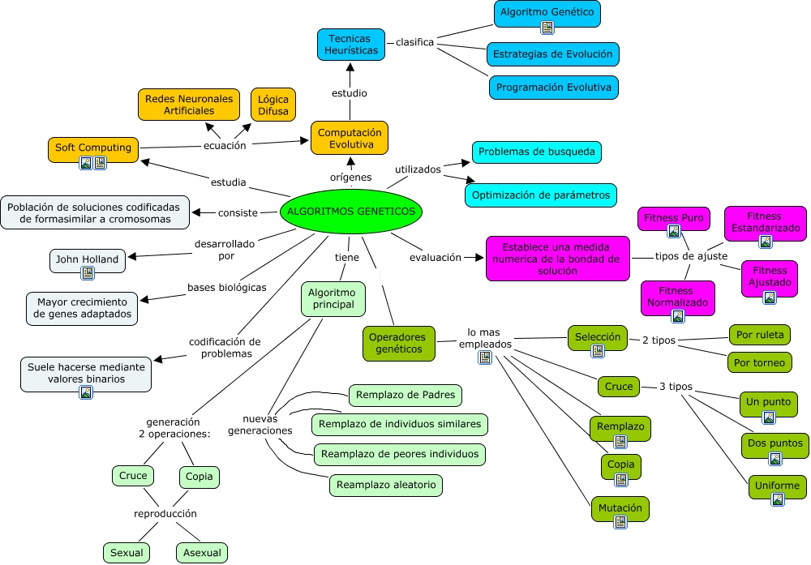
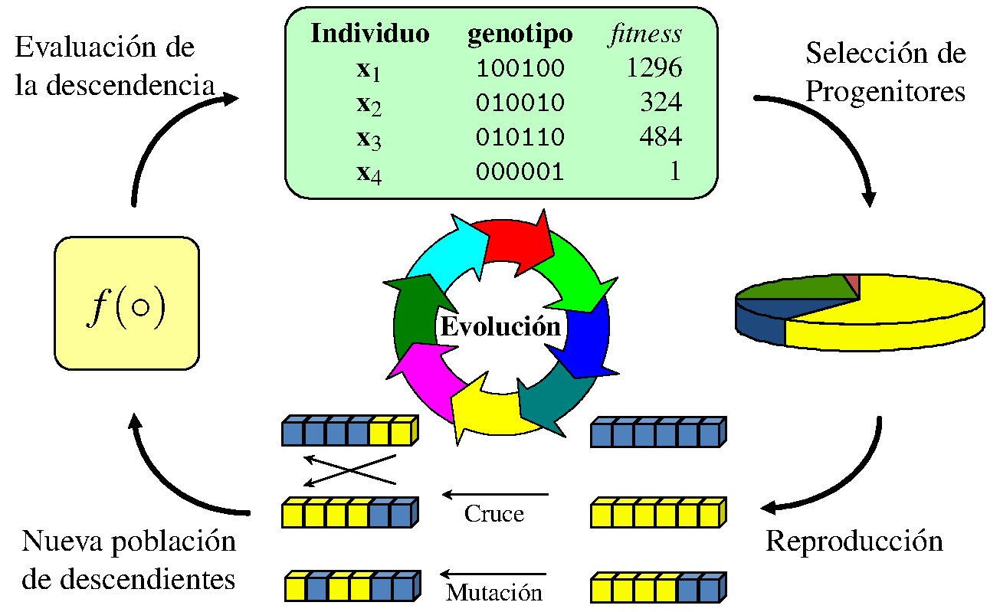
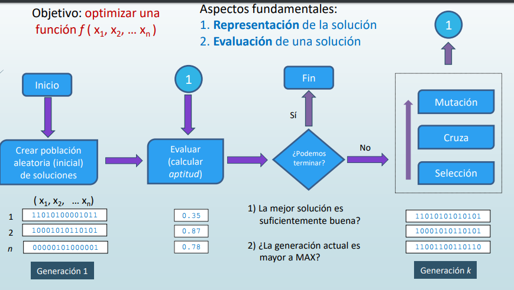
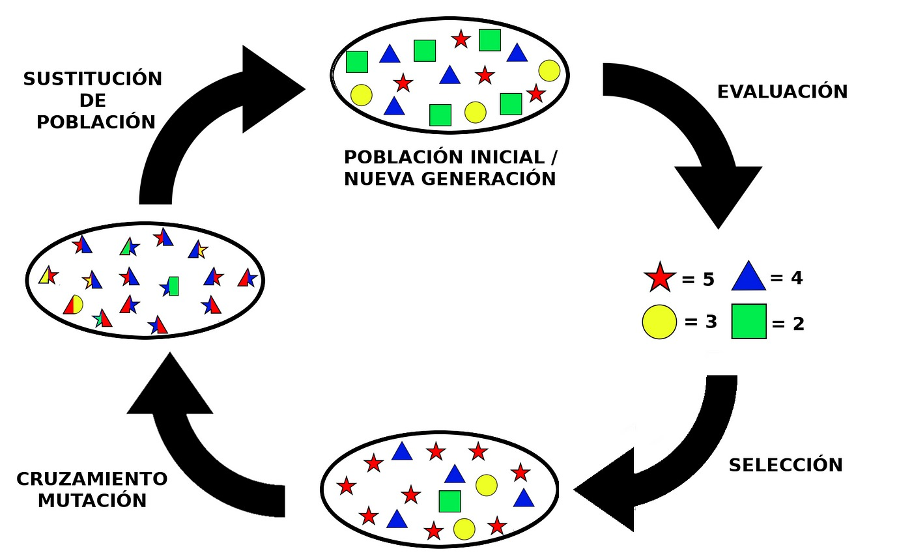

# Algoritmos Genéticos (AG)

* Son métodos adaptativos que pueden ser utilizados para implementar búsquedas y problemas de optimización
* Son una clase particular de algoritmos evolutivos
* Su característica principal es que se basan en técnicas inspiradas en la evolución biológica y genética
* Utilizan reproducción, selección natural y mutación para resolver problemas complejos

## Elementos

* **Población**: conjunto de posibles soluciones al problema que se desea resolver. Estas soluciones se representan mediante estructuras de datos llamadas "individuos" o "cromosomas". El método de AGs consiste en ir obteniendo de forma sucesiva distintas poblaciones
* **Función de evaluación**: es la métrica que permite medir la calidad de cada individuo en términos de su aptitud para resolver el problema. Esta función determina qué individuos son más "aptos" y, por lo tanto, tienen más probabilidades de sobrevivir y reproducirse
* **Operadores genéticos**: son los diferentes métodos u operaciones que se pueden ejercer sobre una población y que nos permite obtener poblaciones nuevas
  * **Selección**: proceso en el cual se eligen los individuos más aptos de la población actual para reproducirse y generar una nueva generación. La selección se realiza de acuerdo con la aptitud de cada individuo, siguiendo una estrategia similar a la selección natural
  * **Reproducción**: consiste en la combinación de los cromosomas de dos individuos seleccionados para crear nuevos individuos, utilizando operadores genéticos como la recombinación y la mutación
  * **Reemplazo**: una vez generada la nueva generación, es necesario reemplazar a la población actual con la nueva generación de individuos. Esto permite que la población evolucione y se acerque cada vez más a una solución óptima
* **Criterio de parada**: condición que determina cuándo se debe detener el algoritmo. Puede ser un número máximo de generaciones, una solución óptima encontrada o un límite de tiempo

* **Individuo**: es un cromosoma y es el código de información sobre el cual opera el algoritmo. Cada solución parcial del problema a optimizar está codificada en forma de cadena o string en un alfabeto determinado, que puede ser binario

* Los operadores genéticos (recombinación y mutación) combinan y modifican soluciones existentes usando **principios lógicos**.
* La función de aptitud utiliza **lógica** para evaluar la calidad de las soluciones
* El proceso de selección se basa en **principios lógicos de selección natural**. El criterio de parada se define **lógicamente** para determinar cuándo detener el algoritmo

## Funcionamiento

1. **Inicialización**: se genera una población inicial de individuos aleatorios
2. **Evaluación**: se calcula la aptitud de cada individuo utilizando la función de evaluación
3. **Selección**: se eligen los individuos más aptos para reproducirse
4. **Reproducción**: se aplican operadores genéticos (recombinación y mutación) para crear nuevos individuos
5. **Reemplazo**: se reemplaza la población actual con la nueva generación de individuos
6. **Convergencia**: se repiten los pasos 2-5 hasta que se alcance un criterio de parada

## Selección

* Es el proceso mediante el cual se eligen los individuos más aptos para la reproducción.
* Los subtipos incluyen:
  * **Selección por torneo**: un pequeño subconjunto de la población se selecciona aleatoriamente y el individuo más apto dentro de este subconjunto se elige para la reproducción
  * **Selección por ruleta**: la probabilidad de seleccionar un individuo es proporcional a su aptitud relativa
  * **Selección por ranking**: los individuos se ordenan según su aptitud y se asignan probabilidades de selección basadas en su posición
  * **Selección elitista**: los mejores individuos son seleccionados directamente para la siguiente generación sin cambios

## Reproducción

* Incluye técnicas para generar nuevos individuos a partir de los seleccionados y puede incluir medidas de fitness
* Los subtipos incluyen:
  * **Recombinación (Cruce)**: proceso de mezclar la información genética de dos padres para crear uno o más hijos. Esto es un ejemplo de reproducción sexual
    * **Cruce de un punto**: se elige un punto de cruce en los cromosomas de los padres y se intercambian las porciones de los cromosomas
    * **Cruce de dos puntos**: se eligen dos puntos de cruce y se intercambian las secciones internas entre los puntos
    * **Cruce uniforme**: cada gen del hijo se toma aleatoriamente de uno de los dos padres
  * **Mutación**: introduce variaciones aleatorias en los individuos para mantener la diversidad genética
    * **Mutación puntual**: un gen en el cromosoma es alterado
    * **Mutación por intercambio**: dos genes en el cromosoma son intercambiados
    * **Mutación por inversión**: una subsección del cromosoma es invertida
  * **Reproducción asexual (Operador de copia)**: un solo individuo se clona para crear descendencia

## Fitness

* La aptitud (fitness) es una medida de la calidad de los individuos y es crucial en la selección y reproducción.
* Los subtipos incluyen:
  * **Fitness puro**: la aptitud directa sin ningún tipo de ajuste
  * **Fitness ajustado**: la aptitud modificada para tener en cuenta ciertos factores, como la diversidad de la población
  * **Fitness estandarizado**: la aptitud transformada para que se ajuste a una escala específica
  * **Fitness normalizado**: la aptitud escalada para que los valores caigan dentro de un rango común, como entre 0 y 1

## Reemplazo

* Se refiere a cómo se introduce la nueva generación en la población, sustituyendo a los individuos previos.
* Los subtipos incluyen:
  * **Reemplazo generacional**: toda la población es reemplazada por la nueva generación
  * **Reemplazo por torneos**: parte de la población es reemplazada mediante torneos entre individuos viejos y nuevos
  * **Reemplazo elitista**: algunos de los mejores individuos de la generación anterior se mantienen en la nueva generación para asegurar la calidad de las soluciones
  * **Reemplazo de padres**: los individuos que fueron seleccionados como padres son reemplazados en la nueva generación
  * **Reemplazo de individuos similares**: los nuevos individuos reemplazan a los más similares genéticamente de la generación anterior para mantener la diversidad
  * **Reemplazo de peores individuos**: los individuos menos aptos de la generación anterior son reemplazados por los nuevos individuos
  * **Reemplazo aleatorio**: algunos individuos de la generación anterior son reemplazados aleatoriamente por nuevos individuos

## Áreas de aplicación

* **Optimización**: los AG se utilizan para resolver problemas de optimización en diversas áreas, como la ingeniería, la logística, la planificación de rutas, la asignación de recursos y la programación.
* **Aprendizaje automático**: los AG pueden utilizarse para optimizar los parámetros y la estructura de modelos de aprendizaje automático, como redes neuronales, para mejorar su rendimiento en tareas específicas.
* **Diseño de productos y procesos**: los AG se aplican en la optimización de diseños de productos y procesos industriales, como el diseño de aerodinámica de vehículos, la generación de circuitos electrónicos, el diseño de fármacos y la ingeniería de materiales.
* **Economía y finanzas**: los AG se utilizan en la optimización de carteras de inversión, el diseño de estrategias de trading, la predicción de precios y la modelización económica.
* **Bioinformática y genómica**: los AG se emplean en el análisis de secuencias genéticas, la identificación de patrones en datos biológicos, la predicción de estructuras proteicas y la inferencia filogenética.
* **Robótica y control**: los AG pueden utilizarse en el diseño y optimización de controladores para robots, la planificación de movimientos, la navegación y la coordinación de múltiples agentes.

## Ventajas

* Exploración eficiente del espacio de búsqueda
* Capacidad para encontrar soluciones óptimas o subóptimas
* Adaptabilidad a problemas complejos con múltiples variables y restricciones
* Tolerancia a ruido o incertidumbre en los datos
* Potencial para la optimización multiobjetivo

## Desventajas

* Necesidad de definir una representación adecuada para el problema
* Posible convergencia prematura hacia una solución subóptima
* Requieren un número considerable de evaluaciones de la función objetivo
* Sensibilidad a la elección de parámetros y operadores
* No garantizan encontrar la solución óptima en todos los casos

## Herramientas Interactivas y Recursos

### Simuladores en Línea

* GA Playground
* [Genetic Algorithm Visualizer](https://www.geneticalgorithms.online/)

### Tutoriales y Ejemplos Prácticos

* [GeeksforGeeks](https://www.geeksforgeeks.org/genetic-algorithms/)
* [Towards Data Science](https://towardsdatascience.com/from-biology-to-computing-an-introduction-to-genetic-algorithms-b39476743483)

### Librerías y Frameworks

* [DEAP (Distributed Evolutionary Algorithms in Python)](https://deap.readthedocs.io/en/master/)
* [GA for TSP on GitHub](https://github.com/ezstoltz/genetic-algorithm)
