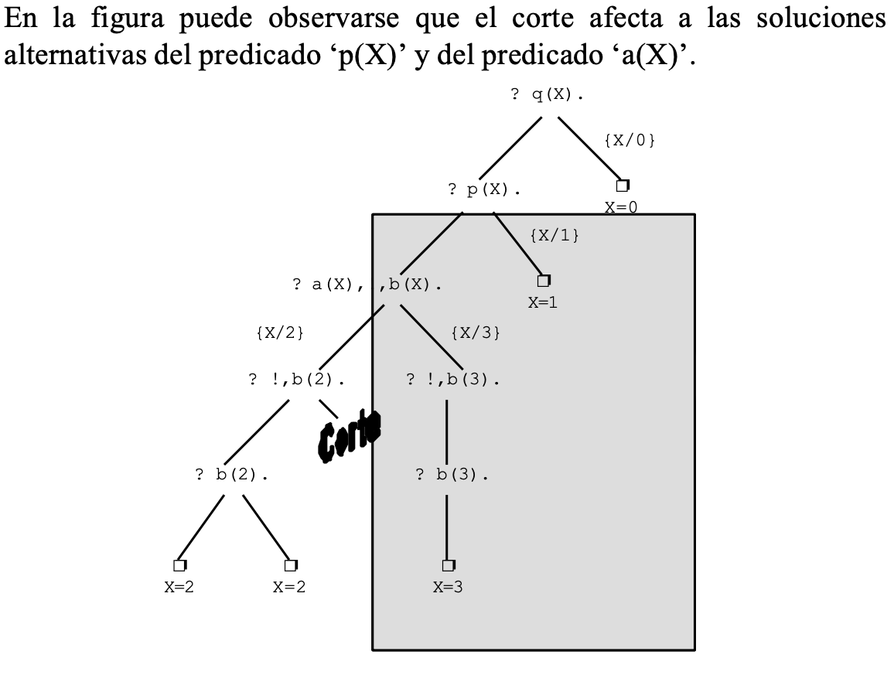

# Programación lógica

## Declarativo vs Operativo

| | Operativo | Declarativo |
| -- | -- | -- |
| **Paradigmas** | Se describe CÓMO resolver el problema | Se describe QUÉ es el problema |
| **Programas** | Sucesión de instrucciones | Conjunto de sentencias |
| **Lenguajes** | Pascal, C, Fortran, ... | Prolog, Lisp, Haskell, ... |
| **Ventajas** | Programas rápidos y especializados | Programas generales, cortos y legibles |

## Historia de la programación lógica

| Año | |
| -- | -- |
| 1960 | Demostración automática de teoremas |
| 1965 | Resolución y unificación (Robinson) |
| 1969 | QA3, obtención de respuesta (Green) |
| 1972 | Implementación de Prolog (Colmerauer) |
| 1974 | Programación lógica (Kowalski) |
| 1977 | Prolog de Edimburgo (Warren) |
| 1981 | Proyecto japonés de Quinta Generación |
| 1986 | Programación lógica con restricciones |
| 1995 | Estándar ISO de Prolog |

## Concepto programación lógica

* Basa su modelo en la utilización de relaciones.
* En la programación lógica, el programa especifica conocimiento acerca del problema a resolver; se hace pregunta y se deja que el sistema deduzca la respuesta usando procesos basados en la lógica matemática (lógica de predicado).
  * Basado en **lógica de primer orden** (reglas de la lógica, lenguaje preciso para expresar conocimiento).
  * Deducir **consecuencias a partir de premisas** (inferir conclusiones a partir de datos).

## Prolog

* Del francés PROgrammation en LOGique.
* Originado en Francia en 1972, por Alain Colmerauer y Philippe Roussel (Universidad de Marsella, Francia).
* En 1995 fue estandarizado, bajo ISO (como C++, Ada, Fortran)
* Es un lenguaje de programación lógico (declarativo opuesto a operativos/procedimentales) e interpretado.
* Basado en reglas de la lógica.
* Usado habitualmente en el campo de la Inteligencia Artificial, particularmente en el campo de sistemas expertos y procesamiento del lenguaje natural.
* También es útil en problemas combinatorios, dada la naturaleza combinatoria del mecanismo de backtracking.

## Instalación

  ```sh
  sudo apt-get update
  sudo apt-get install gprolog
  ```

* Para usarlo online:  [Prolog Online](https://swish.swi-prolog.org/)

## Sintaxis y Semántica

* Un programa en Prolog es un conjunto de **Hechos**  y **Reglas**.

  ```grammar
  H -> TER.
  R -> TERS :- TERS.
  Q -> TERS. 
  TER -> NUM | ATOMO | VAR | ATOMO (TERS)
  TERS -> TER | TER,TERS
  ```

* Ejemplos de términos:
  * número: 1975
  * átomo: pepe
  * variable: X
  * predicado/compuesto: padre(pepe, ana)
  * compuesto más complejo: serie(los_simpsons, autor(Nom, Ape))

### Hechos

* Son los predicados (también llamados compuestos). Un compuesto esta formado por un functor(terminos)
* Son siempre verdaderas.
* Representan la base de conocimiento.
* Ejemplo: se describen una serie de hechos conocidos sobre una familia.

```pl
% Relacion Progenitor
progenitor(pilar,belen).
progenitor(tomas,belen).
progenitor(tomas,lucia).
progenitor(belen,ana).
progenitor(belen,pedro).
progenitor(pedro,jose).
progenitor(pedro,maria).
```

* Los comentarios empiezan con el símbolo %
* Constantes y predicados empiezan con minúsculas.
* Los hechos acaban en punto.
* Variables comienzan con mayúsculas.

| Consulta | Respuesta | Explicación |
| -- | -- | -- |
|  ?- progenitor(pilar,belen). | Yes | Se puede deducir y el objetivo no tiene variables|
|  ?- progenitor(pilar,lucia). | No | No se puede deducir. Todo lo que no está declarado es falso. |
| ?- progenitor(belen,X). | X = ana; X = pedro | Substitución de Respuesta: Se puede deducir y el objetivo tiene variables. Se indica el valor que toman las variables en la resolución del objetivo. La búsqueda de otras soluciones se realiza mediante backtracking |

### Reglas

* Son las **cláusulas de Horn**.
* Constituyen reglas del tipo "modus ponendo ponens", es decir, "si es verdad el antecedente, entonces es verdad el consecuente".
* Forma de escribir las cláusulas de Horn es al contrario de lo habitual. Primero se escribe el consecuente y luego el antecedente.
* El antecedente puede ser una conjunción de condiciones que se denomina secuencia de objetivos.
* Es un predicado con cuerpo.
* El cuerpo es un conjunto de predicados que tienen que ser verdaderos para poder afirmar que la regla es verdadera.
* Las reglas pueden ser: simples, con variables, recursivas, con funciones.

#### Regla simple

* Ejemplo: "Belén cuida a Pedro si Belén está en paro y Pedro es bueno"

```plain
Lógica de predicado:
paro(belen) ^ bueno(pedro) -> cuida(belen,pedro)
```

```pl
paro(belen).
bueno(pedro).
cuida(belen,pedro) :- paro(belen), bueno(pedro).
```

#### Regla con variables

* Ejemplo: "Para todo X e Y, si X es mujer y X es el progenitor de Y,
entonce X es la madre de Y"

```plain
Lógica de predicado:
∀x ∀y (mujer(x) ^ progenitor(x,y) -> madre(x,y))
```

```pl
mujer(pilar).
mujer(belen).
mujer(lucia).
mujer(ana).
mujer(maria).
hombre(tomas).
hombre(pedro).
hombre(jose).
madre(X,Y) :- mujer(X), progenitor(X,Y).
```

| Consulta | Respuesta | Explicación |
| -- | -- | -- |
|  ?- madre(belen,pedro). | Yes | |
|  ?- madre(X,belen). | X = pilar ; no | |
|  ?- madre(belen,X). | X = ana ; X = pedro ; no | Obsérvese que las variables de los objetivos corresponden a cuantificadores existenciales, es decir: ∃x(madre(belen,x)) |
|  ?- madre(X,Y). | X = pilar , Y = belen ; X = belen , Y = ana ; X = belen , Y = pedro ; no | |

#### Reglas recursivas

* En general, en una definición recursiva, es necesario considerar 2 casos:
  * **Caso base**: momento en que se detiene la computación
  * **Caso recursivo**: suponiendo que ya se ha solucionado un caso más simple, cómo descomponer el caso actual hasta llegar al caso simple.

* Tanto el caso base como el caso recursivo no tienen porqué ser únicos (puede haber varios casos básicos y varios casos recursivos)

```pl
antepasado(X,Y) :- progenitor(X,Y).
antepasado(X,Y) :- progenitor(X,Z), antepasado(Z,Y).
```

| Consulta | Respuesta | Explicación |
| -- | -- | -- |
| ?- antepasado(belen,X). | X = ana ; X = pedro ; X = jose ; X = maria ; no | Las definiciones recursivas se resuelven de la misma forma que las reglas comunes |
| ?- antepasado(X,belen). | X = pilar ; X = tomas ; no | |

#### Utilización de funciones

* Prolog no necesita declaraciones de tipos
* Ejemplo: Se utiliza la función: cabeza(x) = "cabeza de x". El programa indica: "Pepe es grande, la cabeza de juan es grande, si X es mayor que Y, entonces X es grande, además: La cabeza de X es mayor que la de Y si X es el progenitor de Y"

```pl
grande(pepe).
grande(cabeza(juan)).
grande(X) :- mayor(X,Y).
mayor(cabeza(X),cabeza(Y)) :- progenitor(X,Y).
```

| Consulta | Respuesta | Explicación |
| -- | -- | -- |
| ?- grande(X). | X = pepe ; X = cabeza(juan) ; X = cabeza(pilar) ; X = cabeza(tomas) ; ... | Las variables en Prolog no tienen tipo, de ahí que la respuesta X puede ser una persona (pepe) o una cabeza (cabeza(juan)) |

#### Datos compuestos

* Los argumentos de una función pueden ser funciones.
* Ejemplo:
  * punto(X,Y) representa un punto de coordenadas (x,y)
  * seg(p1,p2) representa un segmento cuyos extremos son los puntos p1 y p2

```pl
horizontal(seg(punto(X,Y), punto(X1,Y))).
vertical(seg(punto(X,Y), punto(X,Y1))).
```

| Consulta | Respuesta | Explicación |
| -- | -- | -- |
|  ?- horizontal(seg(punto(1,2),punto(3,2))). | Yes | |
|  ?- horizontal(seg(punto(1,2),P)). | P = punto(_47796,2) |  Indica que P es un punto cuya primera coordenada es una variable sin instanciar y cuya segunda coordenada es 2 |
|  ?- horizontal(P),vertical(P). | P=seg(punto(_29128,_29130),punto(_29128,_29130)) | Indica que para que un segmento sea vertical y horizontal a la vez, sus coordenadas deben ser las mismas (los números de las variables X e Y coinciden) |

## Ejecución

* Se basa en unificación y backtracking.
* No es necesario programar el mecanismo de búsqueda.
* En el terminal escribimos predicados para ver si son ciertos o no, dado el conocimiento del programa.
* Cuando introducimos variables, busca valores para las variables que cumplan el predicado.
* La estrategia de resolución de Prolog se llama resolución SLD (Selection-rule driven Linear resolution for Definite clauses); es decir, generalización del modus ponendo ponens junto con la unificación.

## Unificación

* Deducción a través de sustituciones.
* Proceso de localizar patrones que "emparejen" términos.
* Durante la resolución de objetivos, el sistema Prolog debe realizar la unificación entre los objetivos y las cabezas
de las reglas o los hechos.
* Algoritmo:

  ```plain
  1. Inicializar s = substitución vacía
  2. Si al aplicar s a las 2 expresiones, éstas son iguales, finalizar y devolver s
  3. Buscar de izquierda a derecha las primeras subexpresiones diferentes:
      Si dichas subexpresiones están formadas por una variable v y un término t (tal que v / t)
          Actualizar s con el resultado de substituir v por t
          Volver a 2
      Sino 
          Finalizar indicando que las expresiones no unifican
  ```

| Consulta | Respuesta | Explicación |
| -- | -- | -- |
| ?- a = X. | X = a | El operador '=' se cumple si sus argumentos unifican |
| ?- f(X,X) = f(a,Y). | X = a, Y = a |  |
| ?- f(X,X) \\= f(a,Y). | No | El operador '\\=' se cumple si sus argumentos no unifican |
| ?- p(X,X) = p(Y,f(Y)). | Error ..., System Stack Full | Se produce error porque Prolog no implementa chequeo de ocurrencias y el algoritmo de unificación entra en un bucle infinito. |

## Backtracking

* Rastreo inverso.
* Permite encontrar una solución si es que existe alguna.
* Cuando fracasa la unificación de un predicado vuelta atrás y ensayo de otra unificación.
* Algoritmo:

  ```plain
  1. Dado un objetivo, busca algún compuesto con el mismo functor, en la base de conocimiento (de arriba a abajo).
  2. Si es un hecho, unifica con él. (explicación más adelante)
  3. Si es una regla, pasa a tratar de demostrar el cuerpo de la regla.
  4. Si llega a un punto en el que no puede continuar, falla. Vuelve hacia atrás, deshace todas las unificaciones realizadas y si hay algún punto de elección, toma otra ruta.
  ```

* Podemos pensar que el algoritmo va haciendo un árbol intentando encontrar algo en la base de conocimiento que satisfaga el predicado de entrada.
* O viendo cada predicado, podemos ver como puede pasar Prolog en un sentido hacia delante o hacia atrás.

  ```pl
  humano(socrates).
  mortal(X) :- humano(X).

  ?- trace, mortal(X).
  Call:mortal(_1390)
  Call:humano(_436)
  Exit:humano(socrates)
  Exit:mortal(socrates)
  X = socrates
  ```

  ```pl
  progenitor(juan, pedro).
  progenitor(maria, pedro).
  hermano(pedro, vicente).
  hermano(pedro, alberto).
  hermano(A, B) :- progenitor(P, A), progenitor(P, B), A\==B.
  nieto(A, B) :- progenitor(P, A), progenitor(B, P).
  tio(X, Y) :- hermano(X, Z), progenitor(Z, Y).

  ?- trace, tio(U, V).            
  
  Call:tio(_5478,_5474)
    Call:hermano(_500,_736)
    Exit:hermano(pedro,vicente)
    Call:progenitor(vicente,_496)
    Fail:progenitor(vicente,_496)
  Redo:hermano(_500,_730)
    Exit:hermano(pedro,alberto)
    Call:progenitor(alberto,_496)
    Fail:progenitor(alberto,_496)
  Redo:hermano(_500,_730)
    Call:progenitor(_744,_500)
    Exit:progenitor(juan,pedro)
    Call:progenitor(juan,_730)
    Exit:progenitor(juan,pedro)
    Call:pedro\==pedro
    Fail:pedro\==pedro
  Redo:progenitor(_732,_500)
    Exit:progenitor(maria,pedro)
    Call:progenitor(maria,_730)
    Exit:progenitor(maria,pedro)
    Call:pedro\==pedro
    Fail:pedro\==pedro
   Fail:hermano(_500,_730)
  Fail:tio(_500,_496)

  false
  ```

## Corte

* Es uno de los predicados internos más polémicos del lenguaje Prolog.
* Se utiliza para "podar" ramas del árbol de resolución consiguiendo que el sistema vaya más rápido.
* Un mal uso del corte puede podar ramas del árbol de resolución que contengan soluciones impidiendo que el sistema encuentre algunas soluciones (o todas) a un problema dado (impide el retroceso)
* De esta forma se aconseja utilizar el corte con precaución y únicamente en el lugar necesario, Ni antes ni después.
* El predicado corte se representa mediante el símbolo ‘!’ y su efecto es:
  * El predicado siempre se cumple (se satisface)
  * Si se intenta re-ejecutar (al hacer backtracking) elimina las alternativas restantes de los objetivos que hay
desde su posición hasta la cabeza de la regla donde aparece.

  ```prolog
  q(X) :- p(X).
  q(0).
  p(X) :- a(X),!,b(X).
  p(1).
  a(2). 
  a(3).
  b(2). 
  b(2). 
  b(3).
  ```

| Consulta | Respuesta | Explicación |
| -- | -- | -- |
| ?- q(X). | X = 2 ; X = 2 ; X = 0 | Con el corte |
| ?- q(X). | X = 2 ; X = 2 ; X = 3 ; X = 1 ; X = 0 | Sin el corte |



## Pedicados E/S

| Predicado | Efecto | Ejemplo |
| -- | -- | -- |
| write(X) | Escribe el valor del término X |  ?- write(f(x,3+4)). |
| read(X) | Lee un término | ?- read(X) |
| nl | Escribe un salto de línea | |

```pl
saludo:-write('Tu nombre?'), read(N), write('Hola '), write(N).

?- saludo.

% cuando se ponga el nombre, ponerlo en:
% minúscula (ejemplo: pepe) o entre comillas (ejemplo: 'Pepe')

```
