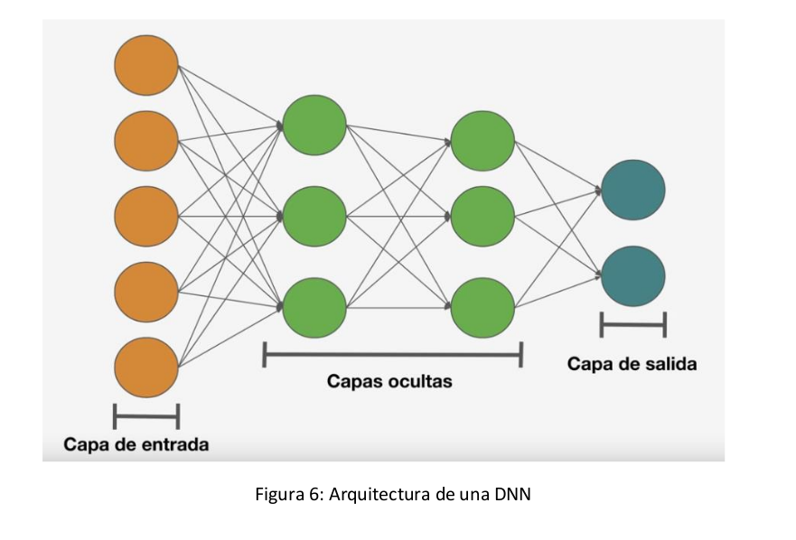

# Redes Neuronales Artificiales (RNA)

* Son modelos de la IA que se inspiran en el comportamiento de las neuronas y las conexiones cerebrales para resolver problemas.
* Es un modelo simplificado que simula cómo los cerebros de los seres vivos, en especial el humano, procesa información
* Las RNA se inspiran en el sistema nervioso y el comportamiento biológico, creando un sistema de interconexión en capas de neuronas artificiales que colaboran para procesar datos de entrada y generar salidas
* Las RNA se diferencian de otros modelos de IA en tener la capacidad de aprender en forma automática Este proceso también es conocido como machine learning o aprendizaje de máquina
* Se basan en entrenar datos para aprender y mejorar su precisión con el tiempo, lo cual es un proceso de machine learning llamado aprendizaje profundo. Utilizan nodos o neuronas interconectadas en una estructura de capas que se parece al cerebro humano. Esta configuración crea un sistema adaptable que las computadoras utilizan para aprender de sus errores y mejorar continuamente

## Modelo general

* La estructura básica de una red neuronal consta de capas de neuronas interconectadas
* La capa de entrada recibe los datos del mundo exterior y los envía a través de la red, mientras que la capa de salida produce el resultado final del procesamiento
* Entre la capa de entrada y la capa de salida, puede haber una o más capas ocultas que procesan la información
* Cada neurona en la red neuronal está conectada a otras neuronas a través de conexiones que se asemejan a las sinapsis biológicas.
* Estas conexiones tienen pesos asociados que determinan la fuerza de la conexión
* Durante el proceso de entrenamiento, estos pesos se ajustan mediante el aprendizaje para mejorar la precisión y el resultado de la salida de la red

* La red neuronal básica se compone de tres capas:
  * **Capa de entrada**: aquí es donde la información del mundo exterior entra en la red. Los nodos de entrada procesan, analizan o clasifican los datos y los envían a la siguiente capa
  * **Capas ocultas**: estas capas toman su entrada de la capa de entrada o de otras capas ocultas. Pueden haber múltiples capas ocultas en una red neuronal artificial
  * **Capa de salida**: proporciona el resultado final del procesamiento de datos realizado por la red neuronal. Puede tener uno o varios nodos de salida

## Funcionamiento

* La red neuronal funciona mediante una serie de procesos que involucran la propagación de datos a través de las neuronas y la utilización de funciones de activación para determinar las salidas
* Cada neurona en la red neuronal utiliza una función de activación para determinar su salida en función de la entrada que recibe. Estas funciones de activación pueden ser lineales, que multiplican la entrada por un peso y agregan un término de sesgo, o no lineales, que son más complejas y permiten a la red modelar relaciones no lineales en los datos
* Una vez que se determina una capa de entrada, se asignan ponderaciones a las conexiones entre las neuronas. Estas ponderaciones determinan la importancia de cada variable de entrada, donde las más grandes contribuyen más significativamente a la salida en comparación con otras entradas. Luego, todas las entradas se multiplican por sus respectivas ponderaciones y se suman. A continuación, la salida se pasa a través de la función de activación correspondiente, que determina la salida de la neurona
* Si la salida supera un determinado umbral, activa el nodo y pasa los datos a la siguiente capa de la red. Este proceso se repite en todas las capas de la red, donde la salida de una neurona se convierte en la entrada de la siguiente. Esto define la red neuronal como una red de propagación hacia delante, donde los datos fluyen en una sola dirección, desde la capa de entrada hasta la capa de salida
* En el caso de las redes neuronales profundas, que tienen múltiples capas ocultas, el proceso de propagación hacia delante se realiza a través de todas las capas ocultas hasta llegar a la capa de salida. Este proceso de propagación hacia delante permite que la red realice tareas de clasificación y predicción
* Además, para entrenar la red neuronal y ajustar sus parámetros para mejorar su rendimiento, se utiliza un proceso llamado retropropagación. En este proceso, se calcula y atribuye el error asociado a cada neurona en la capa de salida, y luego se propagan hacia atrás los errores a través de las capas ocultas hasta llegar a la capa de entrada. Esto permite ajustar y adecuar los parámetros del modelo en función del error cometido y mejorar el rendimiento de la red para tareas futuras

## Aplicaciones

* Tienen una amplia variedad de aplicaciones y usos debido a su capacidad para reconocer patrones complejos en grandes conjuntos de datos
* Algunas de las principales aplicaciones son las siguientes:

* **Reconocimiento de Patrones**:
  * Identificar patrones en ondas sonoras y convertirlas en texto
  * Reconocer características específicas en imágenes, como formas y colores, para clasificarlas en diferentes categorías

* **Procesamiento de Lenguaje Natural (NLP)**:
  * Traducción automática de idiomas al analizar patrones en el lenguaje
  * Generación de texto coherente y relevante para escribir historias o artículos
  * Analizar el lenguaje para entender las intenciones del usuario y proporcionar respuestas adecuadas

* **Visión por Computadora**:
  * Identificación de objetos en imágenes y videos, útil en detección de objetos en tiempo real y seguimiento de objetos
  * Clasificación de imágenes y proporcionar información sobre ellas

  

* **Predicción y Toma de Decisiones**:
  * Análisis de datos para predecir preferencias de compra en el comercio electrónico
  * Aplicación en otras áreas para la predicción y toma de decisiones basadas en patrones reconocidos

* **Visión Artificial**:
  * Reconocimiento visual en vehículos autónomos para identificar señales de tráfico y otros usuarios del camino
  * Moderación de contenido para eliminar automáticamente contenidos inseguros o inapropiados de imágenes y videos
  * Reconocimiento facial para identificar rostros y atributos

* **Reconocimiento de Voz**:
  * Análisis de habla humana para reconocer patrones de habla, tonos, idiomas y acentos
  * Utilizado en asistentes virtuales y software de transcripción automática

* **Motores de Recomendaciones**:
  * Seguimiento de la actividad del usuario para ofrecer recomendaciones personalizadas
  * Descubrir productos o servicios nuevos que puedan interesar a un usuario específico

## Tipos

1. **Redes Neuronales Feedforward**:
    * La información fluye en una sola dirección, desde la capa de entrada hasta la capa de salida, sin ciclos o retroalimentación
    * Se utilizan para tareas de clasificación y predicción
    * Pueden ser entrenadas utilizando algoritmos de aprendizaje supervisado, como la retropropagación, para ajustar los pesos y mejorar la precisión

    

2. **Redes Neuronales Recurrentes**:
    * Tienen conexiones retroalimentadas entre las neuronas, lo que les permite tener "memoria" de datos de entrada anteriores
    * Son útiles para tareas que involucran secuencias de datos, como el procesamiento del lenguaje natural o la predicción de series temporales
    * Para el entrenamiento, se utilizan algoritmos de aprendizaje como la retropropagación a través del tiempo

    

3. **Redes Neuronales Convolucionales (CNN)**:
    * Principalmente utilizadas para el procesamiento de imágenes y videos
    * Organizan las neuronas en capas convolucionales, donde cada neurona está conectada solo a una región local de la capa anterior, lo que permite detectar características específicas en una imagen
    * Aprovechan principios del álgebra lineal, como la multiplicación de matrices, para identificar patrones dentro de una imagen

    

4. Clasificación en base a la estructura:
    * **Monocapa**: una única capa de neuronas sin conexiones entre ellas, adecuada para problemas sencillos
    * **Multicapa**: capa de entrada, capas ocultas y capa de salida. Conexiones entre capas, ampliamente utilizada
    * **Convolucional**: similar a la multicapa, pero con conexiones locales en lugar de globales, ideal para el procesamiento de imágenes
    * **Concurrentes**: neuronas interconectadas de manera no estructurada, permitiendo la memoria y el procesamiento en iteraciones anteriores

5. Clasificación en base al tipo de aprendizaje:
    * **Supervisado**: se proporcionan secuencias de entrenamiento con resultados conocidos para ajustar los pesos de la red y minimizar el error
    * **Corrección de error**: se utilizan algoritmos de cálculo del error como backpropagation para ajustar los pesos
    * **Estocástico**: cambios aleatorios en los pesos para obtener mejores resultados
    * **No supervisado**: algoritmos que buscan patrones y características en los datos de entrada para ajustar los pesos
    * **Refuerzo**: similar al aprendizaje supervisado, pero sin resultados conocidos, solo se indica si el resultado es aceptable o no para ajustar los pesos

## Perceptrón simple

* Es un modelo neuronal binario lineal que separa los resultados en solo dos grupos, aplicado para software IA de agrupación de datos binarios. Cuenta con:
  * Entradas x1, x2 y x3 (valores iniciales binarios: 0 y 1)
  * Pesos sinápticos w1, w2 y w3 correspondientes a cada entrada (valores entre -1 y 1 aleatorios)
  * Función de Iteración wj = wj + e(tj) \* xj (nuevo peso = peso actual + factor de aprendizaje \* valor esperado * entrada)
  * Función de activación f(x) = 1 si el resultado de fórmula es >= 0; caso contrario 0
  * Salida y (se espera obtener los valores esperados binarios)

* Algoritmo:
  1. Ingresar los valores binarios
  1. Realizar el cálculo iterativo de nuevos pesos hasta obtener los valores esperados
  1. Obtener los valores esperados

## Ventajas

* **Aprendizaje Adaptativo**: capacidad de aprender tareas a través del entrenamiento y la experiencia inicial, lo que les permite mejorar su rendimiento con el tiempo
* **Autoorganización**: las redes neuronales pueden crear su propia representación interna de la información a través del aprendizaje, lo que facilita la comprensión y clasificación de datos complejos
* **Generalización**: pueden responder adecuadamente a datos o situaciones que no han sido presentadas durante el entrenamiento, lo que las hace útiles para tareas de predicción y clasificación en entornos cambiantes
* **Tolerancia a fallos**: a pesar de la destrucción parcial de la red, pueden retener algunas capacidades y aprender a reconocer patrones incluso en datos ruidosos, distorsionados o incompletos
* **Operación en Tiempo Real**: las redes neuronales pueden implementarse en paralelo, lo que les permite operar en tiempo real y realizar cálculos más rápidos en tareas específicas
* **Fácil Inserción en Tecnología Existente**: se pueden obtener chips especializados para redes neuronales, lo que facilita su integración modular en sistemas existentes, mejorando su capacidad para tareas específicas

## Desventajas

* **Necesidad de Grandes Cantidades de Datos**: requieren grandes conjuntos de datos para entrenar con precisión, lo que puede ser costoso o limitar su uso en entornos con datos escasos
* **Dificultad en la interpretación**: las redes neuronales son difíciles de interpretar, lo que dificulta comprender cómo y por qué llegan a ciertas predicciones, lo que puede plantear problemas en aplicaciones críticas
* **Sobreentrenamiento**: debido a su alta capacidad de aprendizaje, las redes neuronales pueden sobre-ajustarse a los datos de entrenamiento y tener un rendimiento deficiente en datos nuevos
* **Función de Pérdida No Convexa**: los perceptrones multicapa pueden tener múltiples mínimos locales en su función de pérdida, lo que hace que los resultados puedan variar según los valores iniciales de los pesos
* **Ajuste de Hiper-parámetros**: es necesario ajustar varios hiper-parámetros, como el número de capas ocultas y funciones de activación, lo que puede requerir un esfuerzo significativo para optimizar su rendimiento
* **Sensibilidad a la Escala de Datos**: las redes neuronales son sensibles a la escala de los datos, por lo que se requiere una transformación adecuada de los datos para obtener un rendimiento óptimo
